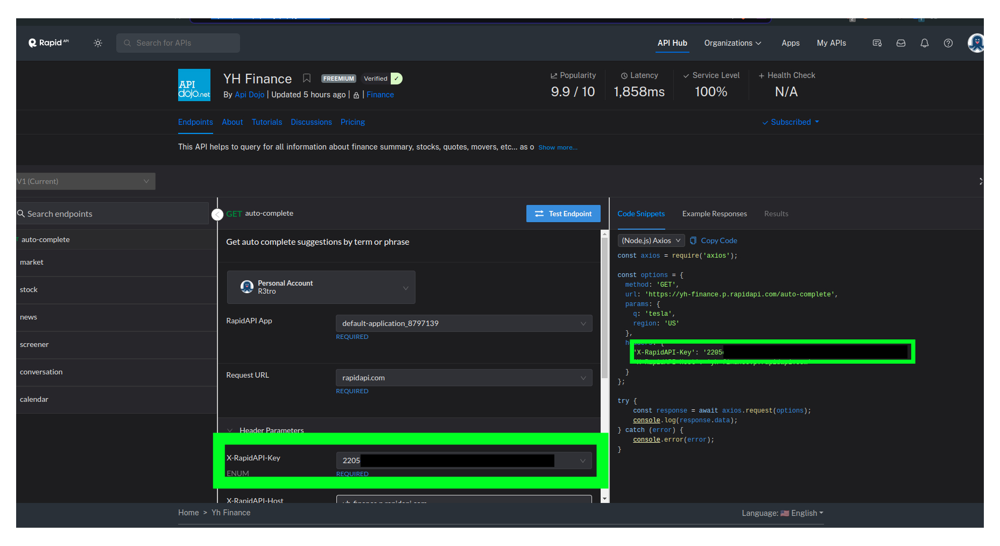

# Portfólio
Táto aplikácia zobrazuje informácie o aktuálnych cenách akcií vo vašom portfóliu

## Návod na správne spustenie
### Požiadavky na fungovanie
- nainštalovaný Docker a Docker compose

### Rozbehnutie aplikácie
1. stiahnuť použitím `git clone git@github.com:R3tr066/Portfolio.git Portfolio`
2. `cd Portfolio`
3. vytvorenie úložiska pre dáta z databázy `docker volume create postgres-data`
4. rozbehnutie aplikácie `docker compose up -d`
5. vytvorenie súboru s nataveniami aplikácie`cp app/settings.php.dist app/settings.php`
6. vytvoriť účet na: https://rapidapi.com/ (ak už máte účet môžete tento krok preskočit a ísť na ďaľší)
7. vybrať si predplatné na: https://rapidapi.com/apidojo/api/yh-finance/pricing
8. ak máme predlplatné tak na: https://rapidapi.com/apidojo/api/yh-finance naj́sť a okopírovať Apikey a vložiť ho do settings.php 
6. vytvorenie schémy v databáze `docker exec -it portfolio-php php db/001.php`
7. aplikaciu si môžete pozrieť na http://localhost:8080/
### Zapnutie a vypnutie aplikácie
- vypnutie aplikácie `docker compose stop`
- zapnutie aplikacie `docker compose start`
